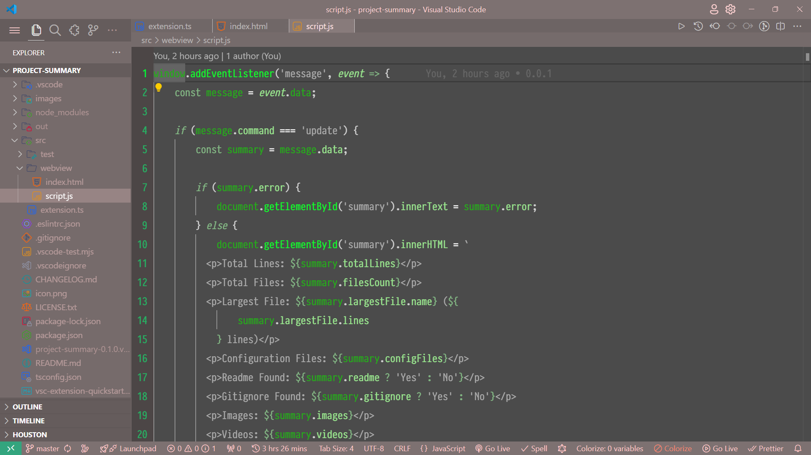
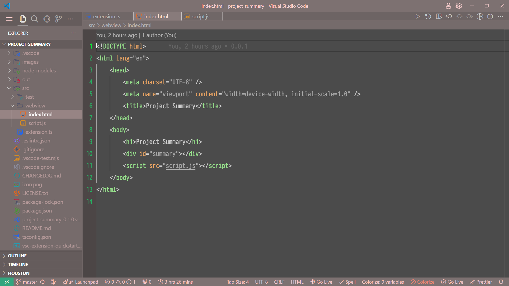
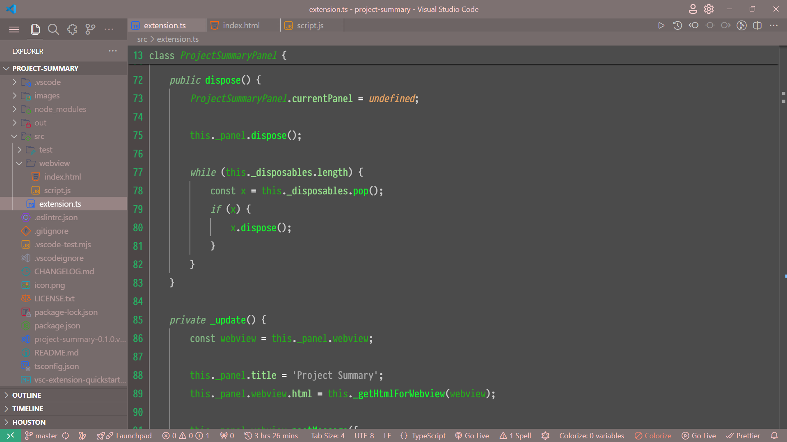

# Smoky Theme

## Overview

The Smoky Theme is designed to bring a sense of elegance and mystery to your user interface. With its subtle hues and soft contrasts, it creates an atmosphere of sophistication while maintaining readability and usability.

## Features

- **Subtle Color Palette:** The Smoky Theme features a palette of muted tones, reminiscent of wisps of smoke, creating a calming and refined visual experience.
- **Sleek Design Elements:** Clean lines and minimalist design elements ensure that the focus remains on your content, while still adding a touch of sophistication to your interface.

- **Customizable:** Easily tweak the theme to match your preferences with customizable options for accent colors, fonts, and more.

- **Compatible:** Compatible with a wide range of applications and platforms, including code editors, text processors, and design tools.

## Installation

To install the Smoky Theme, follow these simple steps:

1. Clone or download the repository.
2. Copy the theme files to the appropriate directory for your application.
3. Select the Smoky Theme from your application's settings or preferences menu.

## Screenshots

Here are some screenshots showcasing the Smoky Theme in action:

## License

The Smoky Theme is licensed under the [MIT License](https://opensource.org/licenses/MIT). See the `LICENSE` file for more information.

---

Feel free to adjust the content and links as needed.
